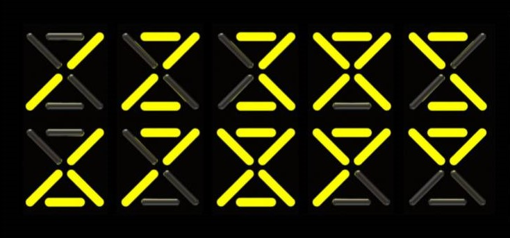
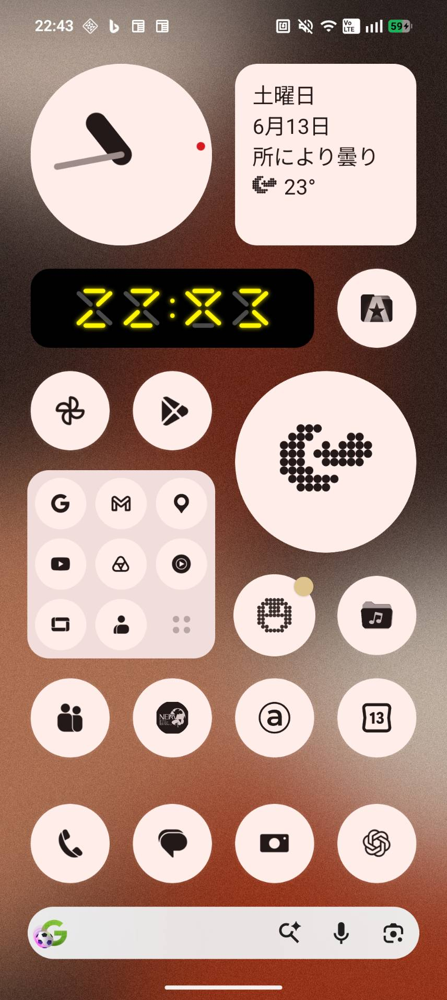

# 6 SEG CLOCK

**6 SEG CLOCK** is an Android home screen widget clock based on the 2017 concept **6 SEGMENT LED WATCH**.

It does not use the familiar 7-segment display.  
Instead, it reconstructs numbers using only **six segments**: two horizontal lines and four diagonal lines.

A digital clock with a number system that could have existed.

---

## Screenshots

### Widget on Android home screen

### 6 segment clock display

---

## Concept

In ordinary digital displays, numbers are usually drawn with seven segments.  
**6 SEG CLOCK** removes the vertical segments and rebuilds the numerals with only horizontal and diagonal strokes.

The result is not just a reduced 7-segment display.  
It becomes a small alternative numeral system — readable as time, but also appearing as a glowing sign or electronic symbol.

This project revives the original 2017 watch idea as an Android widget.

---

## Features

- Android home screen widget
- Original 6-segment numeral display
- Black background with yellow LED-style segments
- 12-hour / 24-hour display based on device settings
- Minute-based clock update
- Tap the widget to open a full-screen clock preview

---

## How to use

1. Download and install the APK.
2. Long-press the Android home screen.
3. Select **Widgets**.
4. Add **6 SEG CLOCK** to the home screen.
5. Resize the widget if needed.

---

## Notes

Android home screen widgets are not suited for constant second-by-second updates because of battery and system restrictions.  
For that reason, **6 SEG CLOCK** updates as a practical minute-based clock.

---

## Version

**v0.1.7**

Adjustments included in this version:

- Corrected the original 6-segment digit shapes
- Adjusted the center gap of the X-shaped diagonal segments
- Enlarged the center colon so its dot diameter matches the segment stroke width
- Increased the vertical spacing of the colon
- Slightly tightened the spacing between digits

---

## Original Idea

**6 SEGMENT LED WATCH**  
Concept originally developed in 2017.

This Android widget version brings the idea back as a small everyday object on the smartphone home screen.

---

## Author

MASATO / MASATO LAB
